# Lumen Eye Care — App Flow & Validation Diagrams v1

**Purpose:** Visual map of every flow in the v1 build. For the junior dev to see how the pieces connect before writing code; for the experienced dev to sanity-check the system before implementing. Diagrams render natively on GitHub and in most Markdown editors.

**Companion docs:** `Outputs/Lumen_Handoff_v1.docx` (full spec), `Outputs/Lumen_CLAUDE.md` (repo rules).

**Conventions used in diagrams:**
- 🟢 Solid arrows = primary path
- 🔴 Dashed arrows = error / fallback path
- Rectangles = pages or actions
- Diamonds = decisions / validation gates
- Cylinders = persisted data (DB / storage)
- Hexagons = external services (Paystack, Resend, WhatsApp)

---

## 1. High-level customer journey

End-to-end, what a Ghanaian customer does from first social link click to wearing the frames.

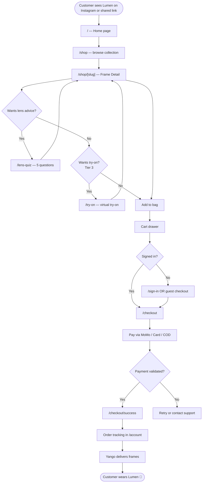

**Captions:**
- The customer never has to sign in to buy (guest checkout is allowed); but signing in unlocks order tracking, address re-use, and the prescription history.
- Lens Quiz and Try-On are optional side-paths off the Frame Detail page — they enrich the experience but never block a purchase.
- The post-payment "validate" gate is the Paystack webhook (see Section 5 for the sequence).

---

## 2. Authentication flow (with email validation)

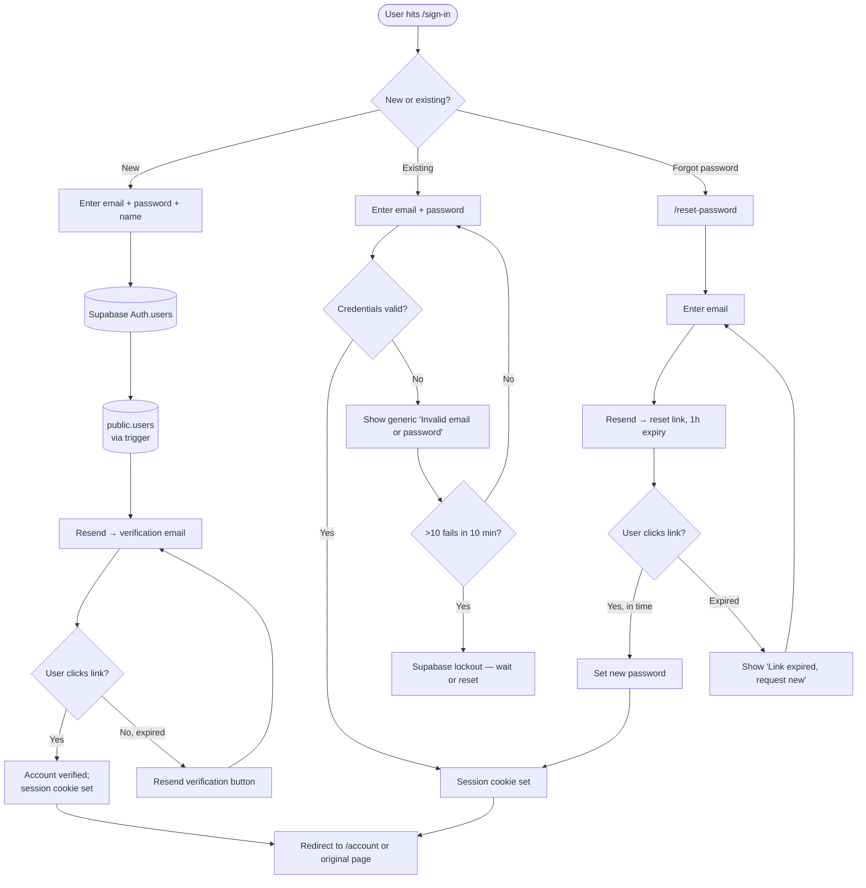

**Validation specifics:**
- **Generic error messages on signin** — never reveal "this email exists" via differing error text (account enumeration risk).
- **Email verification optional in dev, required in production** — toggle via Supabase project setting.
- **Lockout uses Supabase built-in** — no DIY rate limiting needed.
- **Password reset link expires in 1 hour** — Supabase default; reasonable for Ghana mobile-data scenarios where users may not check email immediately.

---

## 3. Browse → Frame Detail → Cart

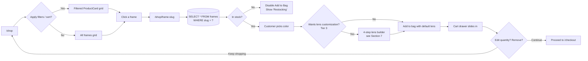

**Notes:**
- Cart persists in `localStorage` AND syncs to DB for signed-in users (so cart follows them across devices).
- Out-of-stock frames stay on the catalogue (good for SEO + email signups) — only the Add-to-Bag CTA disables.
- Frame slug is the URL-safe lower-kebab of the name (`accra` not `Accra`).

---

## 4. Checkout — multi-step with payment branching

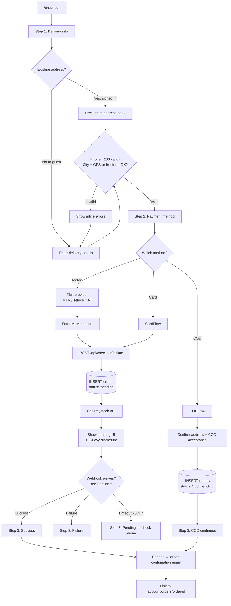

**Validation gates:**
- **Phone**: `libphonenumber-js` normalises `0XX...` → `+233XX...`; reject non-Ghana numbers in v1.
- **GhanaPostGPS code (optional)**: validate format `GA-123-4567` if provided; do not require.
- **Address**: at minimum need name + phone + city + freeform line — landmark optional but recommended.
- **MoMo phone**: same E.164 normalisation; can differ from delivery contact phone.
- **E-Levy disclosure**: required by GRA, displayed inline before the customer submits MoMo payment.

---

## 5. Payment validation — Paystack sequence + webhook verification

This is the highest-stakes flow. Get the webhook signature verification right and idempotency right; the rest follows.

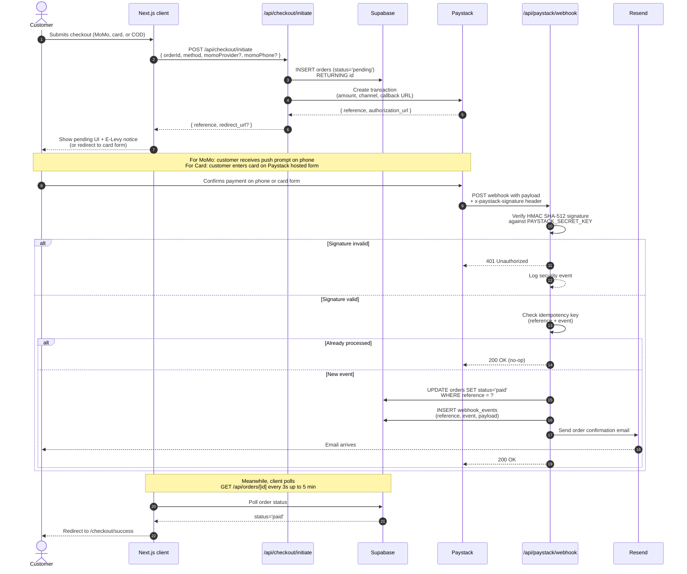

**Validation hardening:**
- **HMAC verification** uses the raw request body (NOT the parsed JSON) — common bug source.
- **Idempotency key** = `paystack_event_id`. Stored in `webhook_events` table; reject duplicates with `200 OK no-op` (Paystack retries on non-200).
- **Order state transitions** are append-only: `pending → paid` or `pending → failed`, never `paid → pending`. Enforce via Postgres CHECK constraint or trigger.
- **Polling**: client polls for up to 5 minutes (longer than MoMo's typical confirmation window); past that, show "still processing, we'll email you" state.
- **COD path** skips this entire flow — order is `cod_pending` until Charity marks `cod_collected` in admin.

---

## 6. Prescription flow — with feature flag and WhatsApp fallback

This is the most regulatory-sensitive flow. Treat the feature flag and the DPC consent as non-negotiable.

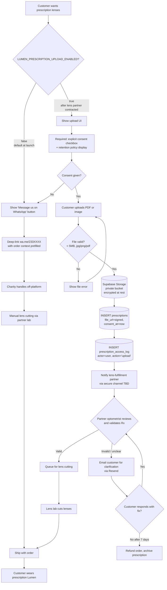

**Why this is feature-flagged at launch:**
1. Storing prescriptions = sensitive health data under Ghana DPA 2012 → triggers DPC registration as data controller (Charity's workstream, not the agency's).
2. Needs a named, contracted lens-fulfillment partner (optical lab) before public exposure.
3. Until both are in place, the flag stays `false` and the WhatsApp path is the only customer-visible option. Charity manages prescriptions off-platform manually.

**Online validation steps shown above:**
- File-level validation: MIME type, file size, page count.
- Consent validation: must be given explicitly before upload completes.
- Clinical validation: licensed optometrist (partner clinic) reviews the prescription before lens cutting — that's the human-in-the-loop. The system does not interpret prescriptions clinically — that would require regulatory approval Lumen doesn't have.
- Audit logging: every signed-URL generation logged with actor + timestamp.

---

## 7. Virtual Try-On (Tier 3)

The Tier 3 stretch feature. Ships only if Week-5 checkpoint is green.

```mermaid
flowchart TD
    Start["/try-on or click 'Try this on' from Frame Detail"] --> CheckPhoto{Photo previously uploaded?<br/>localStorage check}
    CheckPhoto -->|Yes| LoadPhoto[Load existing photo + transforms]
    CheckPhoto -->|No| UploadUI[Upload photo prompt]
    UploadUI --> PickPhoto[Customer picks portrait photo]
    PickPhoto --> ValidatePhoto{File valid?<br/>image, < 10MB}
    ValidatePhoto -->|No| PhotoError[Show error]
    PhotoError --> PickPhoto
    ValidatePhoto -->|Yes| StorePhoto[(localStorage:<br/>image-slot:tryon-face<br/>base64 encoded)]
    StorePhoto --> LoadPhoto
    LoadPhoto --> SelectFrame[Show frame overlay on photo]
    SelectFrame --> Transform[Customer drags/resizes overlay]
    Transform --> SaveTransform[(localStorage:<br/>lumen-tryon-frame-id<br/>{x, y, scale})]
    SaveTransform --> Compare{Wants to compare<br/>2 frames side by side?}
    Compare -->|Yes| PickSecond[Pick second frame]
    PickSecond --> SideBySide[Render two photos side by side]
    SideBySide --> Decide[Customer decides]
    Compare -->|No| Decide
    Decide --> Buy[Click 'Buy this one']
    Buy --> Cart[Add to cart with this frame + color]
    Cart --> Detail["Frame Detail with selection prefilled"]
```

**Validation specifics for try-on:**
- **Photo never leaves the device** in v1 — stored in `localStorage` as base64. Privacy by design.
- **No backend upload for try-on photos** — keeps storage cost zero and privacy footprint tiny.
- **Transforms per frame** — different frames may need different positioning; each gets its own localStorage key.
- **Tier 3 fallback**: if Try-On isn't shipped, the link silently doesn't render in the nav and Frame Detail; no broken UI.

---

## 8. Lens Quiz (Tier 2)

```mermaid
flowchart LR
    Start["/lens-quiz"] --> Q1[Q1: Vision type?<br/>Distance / Reading / Progressive]
    Q1 --> Q2[Q2: Screen time per day?<br/>< 4h / 4-8h / 8h+]
    Q2 --> Q3[Q3: Outdoor activity?<br/>Indoor / Mixed / Outdoor]
    Q3 --> Q4[Q4: Lens priority?<br/>Comfort / Style / Price]
    Q4 --> Q5[Q5: Driving / sports?<br/>Yes / No]
    Q5 --> Score[Score answers → match weights]
    Score --> Recommend[Recommend 2-3 frames + lens config]
    Recommend --> CTA[Buttons:<br/>'View frames' or 'Restart quiz']
    CTA --> Browse[/shop with filter prefilled/]
```

**Validation:**
- Each question requires an answer before advancing (button disabled until selected).
- Score → recommendation logic is a pure function in `src/lib/quiz-engine.ts` — unit tested with Vitest. Snapshot tests on the recommendation outputs.

---

## 9. Appointment request (Tier 2) — partner clinic consultation

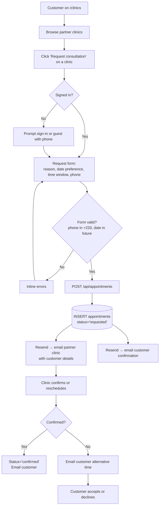

**Important framing**: the request is for a **consultation** (commercial term), not a **medical exam** (clinical term). This is the linguistic guardrail per Handoff Section 9 — protects Charity given the informal optometrist arrangement.

---

## 10. Admin flow — orders + catalogue (Tier 2)

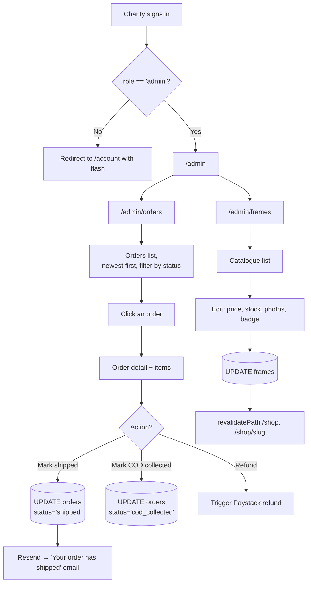

**Validation:**
- Admin role check via Supabase Auth JWT claim — middleware on `/admin/*`.
- Price changes log to an audit table so retroactive accusations of "you sold me at the wrong price" can be checked.
- Stock decrements happen at order completion (Paystack webhook `paid` event), not at add-to-cart — prevents holding stock for abandoned carts.

---

## 11. Edge case flows

### 11.1 Payment timeout — MoMo prompt never confirmed

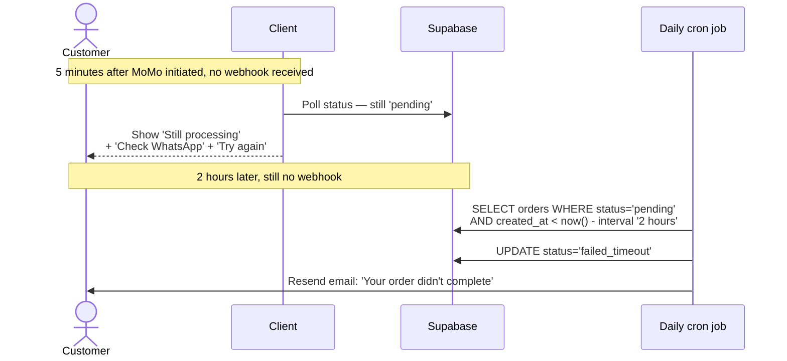

### 11.2 Network failure during checkout submit

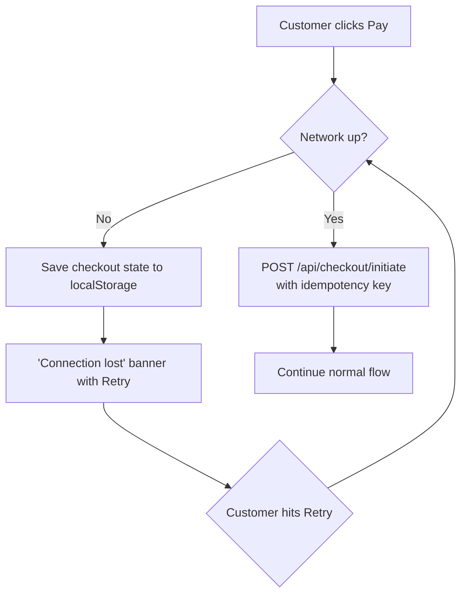

### 11.3 Duplicate submit (double-click on Pay)

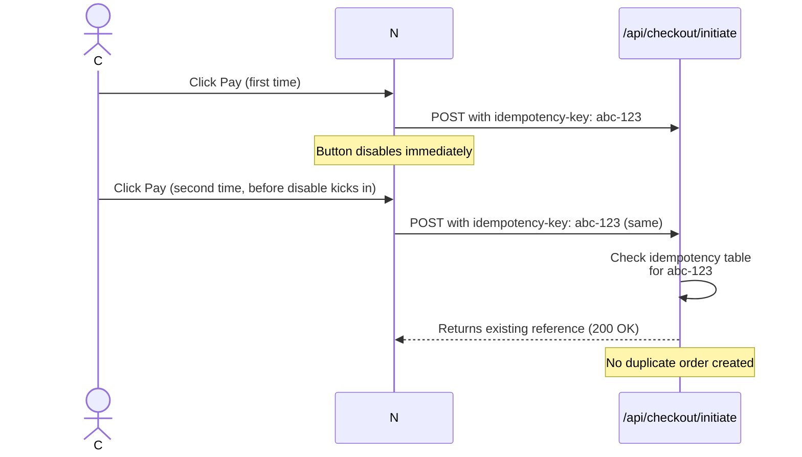

### 11.4 Expired prescription

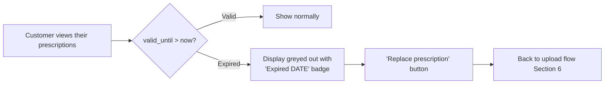

---

## 12. What this diagram set does NOT cover

Intentionally out of scope of this doc (covered elsewhere or not in v1):

- **Tax calculations** beyond E-Levy disclosure — Charity is under the GHS 50,000 threshold, all-taxes-inclusive pricing applies. No display.
- **Currency conversion** — GHS only. No USD or other.
- **SMS notifications** — deferred to v1.5 per Out of Scope.
- **Push notifications** — out of scope (web-only, no service worker / web push in v1).
- **Inventory forecasting / restock alerts** — out of scope.
- **Customer reviews / ratings** — out of scope.
- **Wishlist** — out of scope.
- **Multi-currency or multi-language** — out of scope.

---

## How to use this doc during the build

1. **At the start of each Sprint**, the dev reads the relevant flow before coding. Don't build a flow from memory.
2. **When implementing**, link the user story to the flow (e.g., "implements US-P0-05 (MoMo checkout) per app-flow.md Section 5").
3. **When the flow changes during build** (and it will), update this doc in the same PR. Don't let docs drift from code.
4. **For Claude Code**: in the project repo, commit this file as `docs/app-flow.md`. When prompting Claude Code for a new feature, reference the relevant section: "Implement the prescription upload flow per `docs/app-flow.md` Section 6, with the feature flag default `false`."

---

**Last updated:** 5 June 2026 — Bryan & Etornam
**Companion files:** `Outputs/Lumen_Handoff_v1.docx`, `Outputs/Lumen_CLAUDE.md`, `Outputs/Lumen_Proposal_v3.docx`
